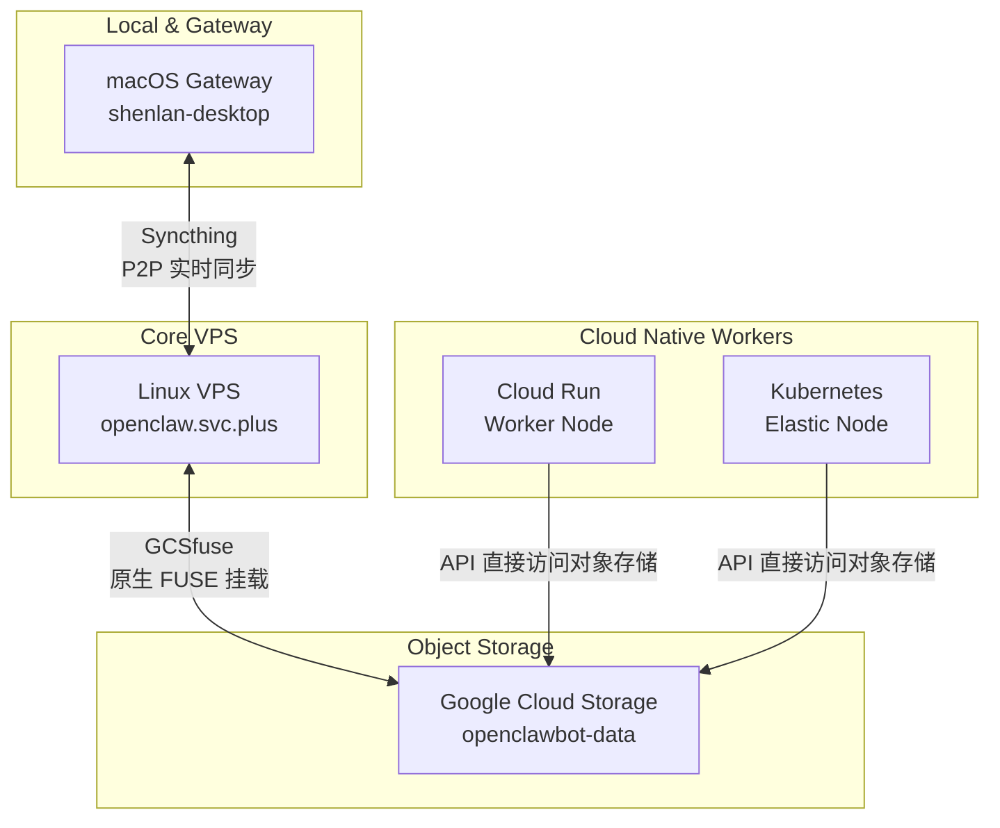

# Runbook: Syncthing + GCSfuse Storage Architecture

本手册详细说明如何基于 Syncthing 和 GCSfuse 构建跨平台的云中性存储架构。此架构利用 Syncthing 实现 macOS (Gateway) 与 Linux (Core VPS) 之间的毫秒级双向同步，并利用云端的 GCSfuse 将 Linux 核心同步目录直接挂载至 Google Cloud Storage (GCS)。

该架构彻底取代了此前的 JuiceFS 及 NFS 等方案，**规避了 macOS 内核加载和隔离引起的本地安全与权限麻烦**，同时也得益于原生 GCS FUSE 节省掉了基于 Rclone 定期打包上传的延时。这套机制专门为保障 `openclawbot` 跨平台状态和记忆数据的高一致性、长效保存需求所设计。

## 🏗 架构总览



- **macOS Gateway (shenlan-desktop)**: 本地存储目录 (例如: `/opt/data`) 充当数据录入与交互的高速网关。
- **Linux Core (openclaw.svc.plus)**: 利用 GCSfuse 直接挂载 GCS 到中间核心同步目录 (`/opt/data`)，充当云上落地层。
- **Object Storage (GCS)**: `openclawbot-data` 云存储桶作为最终权威数据源。

---

## 1. 环境准备：清理原生和遗留挂载

如果你曾经在 macOS 配置过 JuiceFS 或 NFS 网络挂载，请提前彻底解挂：
```bash
# MacOS - 强制卸载残留占用
sudo diskutil unmount force /opt/data
```
然后确保 `/opt/data` 此时是一个干净的本地普通文件目录。

---

## 2. macOS Gateway 节点配置 (shenlan-desktop)

### 2.1 安装 Syncthing
在本地 macOS 上通过 Homebrew 原生安装 Syncthing 客户端并配置开机自启：
```bash
brew install syncthing
brew services start syncthing
```

### 2.2 配置本地同步目录
启动后 Syncthing 默认在 `http://127.0.0.1:8384` 提供 Web 管理页面。
- 打开浏览器访问 `http://127.0.0.1:8384`。
- 获取当前 shenlan-desktop 的**设备 ID**。
- 添加需要同步的本地文件夹：指定路径为 `/opt/data`，并建议将**文件夹 ID** 强制设定为 `openclawbot-data` 以对接 Linux 端。

---

## 3. Linux Core VPS 配置: GCSfuse 与 Syncthing (openclaw.svc.plus)

### 3.1 安装与挂载 GCSfuse
核心主机 `openclaw.svc.plus` 直接运行 `gcsfuse` 将 bucket 挂载至同步目录，省去了 Rclone 的轮询烦恼：

1. **添加 Google Cloud SDK 软件源并安装 gcsfuse:**
```bash
export GCSFUSE_REPO=gcsfuse-`lsb_release -c -s`
echo "deb https://packages.cloud.google.com/apt $GCSFUSE_REPO main" | sudo tee /etc/apt/sources.list.d/gcsfuse.list
curl https://packages.cloud.google.com/apt/doc/apt-key.gpg | sudo apt-key add -
sudo apt-get update
sudo apt-get install gcsfuse -y
```

2. **GCP 认证准备：**
确保该 Linux 上的默认应用程序凭证对相关的 GCS 桶存在完整的读写权限：
```bash
gcloud auth application-default login
```

3. **创建目录并执行挂载：**
```bash
sudo mkdir -p /opt/data
sudo chown -R $USER:$USER /opt/data

gcsfuse --implicit-dirs openclawbot-data /opt/data
```
*(可将其写入 `/etc/fstab` 以实现开机自动挂载：`openclawbot-data /opt/data gcsfuse rw,user,key_file=/path/to/key.json,_netdev,allow_other 0 0`)*

### 3.2 安装并对接 Syncthing
当 `/opt/data` 已经被 gcsfuse 接管后，接着安装 Syncthing 以对接 macOS 网关上的修改：

```bash
sudo curl -o /usr/share/keyrings/syncthing-archive-keyring.gpg https://syncthing.net/release-key.gpg
echo "deb [signed-by=/usr/share/keyrings/syncthing-archive-keyring.gpg] https://apt.syncthing.net/ syncthing stable" | sudo tee /etc/apt/sources.list.d/syncthing.list
sudo apt-get update
sudo apt-get install syncthing

# 设置系统服务开机常驻
sudo systemctl enable syncthing@ubuntu.service
sudo systemctl start syncthing@ubuntu.service
```

- 获取当前 Linux VPS 的网络通信设别 ID。
- 然后在 macOS 端和 Linux 端的 Web 管理面板互加双方为信任设备。
- 允许互联并使用相同的文件夹 ID (`openclawbot-data`) 绑定共享到服务端的 `/opt/data` 下。
- **数据流转原理**：此时，一旦 macOS 端写入文件，便由 Syncthing P2P 秒级同步到 Linux 上的 `/opt/data`，随后立刻由正在底层的 `gcsfuse` 将新文件接管存储至对象存储。

---

## 4. Cloud Run / Kubernetes 接入侧

在 Cloud Run 等负载型云原生无状态节点（Worker Node）上，直接调用原生网络或原生存储能力即可：
- 使用原生的 Google Cloud Storage Client SDK 或直接请求 S3/GCS API；
- 精准定位并读写以获得最及时的一致性交互存取；
- 或直接在 Cloud Run 服务的“设置容积方案的 Volume Mount”中使用原生的云容器机制绑定至该存储桶（Cloud Run 内置原生支持 Volume mount GCS）。

这种去中介化读写能够最充分地发挥云的水平弹性和并行负载优势。
